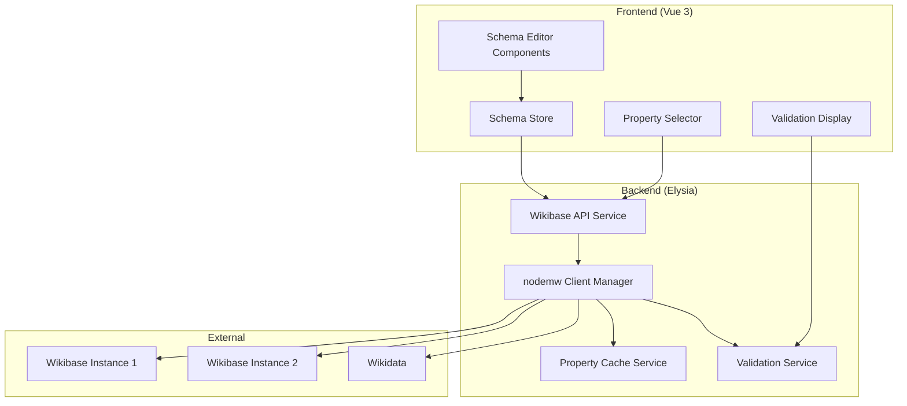

# Design Document

## Overview

This design document outlines the integration of the `nodemw` MediaWiki API client with the existing Wikibase Schema editor. The integration will replace the current REST API approach with a more robust solution that leverages `nodemw`'s comprehensive MediaWiki API coverage, built-in request management, and specific Wikidata/Wikibase support.

The design maintains compatibility with the existing schema editor architecture while enhancing it with better property search, constraint validation, and real-time data retrieval capabilities.

## Architecture

### High-Level Architecture



### Integration Points

The `nodemw` integration will enhance the existing architecture at these key points:

1. **Backend Service Layer**: Replace `WikibaseApiService` with `NodemwWikibaseService`
2. **Property Search**: Enhance property search with `nodemw`'s comprehensive search capabilities
3. **Constraint Validation**: Add real-time constraint validation using `nodemw`'s Wikidata API
4. **Cache Management**: Implement intelligent caching on top of `nodemw`'s request queuing
5. **Multi-Instance Support**: Leverage `nodemw`'s multi-wiki capabilities for instance management

## Components and Interfaces

### Backend Components

#### 1. NodemwWikibaseService

Replaces the existing `WikibaseApiService` with enhanced functionality:

```typescript
export class NodemwWikibaseService {
  private clients: Map<string, nodemw> = new Map()
  private wikidataClients: Map<string, WikidataClient> = new Map()
  private instances: Map<string, WikibaseInstanceConfig> = new Map()
  private cache: PropertyCacheService
  private validator: ConstraintValidationService

  // Client management
  createClient(instanceConfig: WikibaseInstanceConfig): nodemw
  getClient(instanceId: string): nodemw
  getWikidataClient(instanceId: string): WikidataClient
  
  // Property operations
  async searchProperties(instanceId: string, query: string, options: SearchOptions): Promise<PropertySearchResponse>
  async getProperty(instanceId: string, propertyId: string): Promise<PropertyDetails>
  async getPropertyConstraints(instanceId: string, propertyId: string): Promise<PropertyConstraint[]>
  
  // Item ope
sync searchItems(instanceId: string, query: string, options: SearchOptions): Promise<ItemSearchResponse>
  async getItem(instanceId: string, itemId: string): Promise<ItemDetails>
  
  // Validation operations
  async validatePropertyValue(instanceId: string, propertyId: string, value: any): Promise<ValidationResult>
  async validateSchema(instanceId: string, schema: SchemaMapping): Promise<SchemaValidationResult>
}
```

#### 2. PropertyCacheService

Intelligent caching layer built on top of `nodemw`'s request management:

```typescript
export class PropertyCacheService {
  private cache: Map<string, CacheEntry> = new Map()
  private ttlMap: Map<string, number> = new Map()
  
  async get<T>(key: string, fetcher: () => Promise<T>, ttl?: number): Promise<T>
  async invalidate(pattern: string): Promise<void>
  async clear(instanceId?: string): Promise<void>
  
  // Cache strategies
  private generateCacheKey(instanceId: string, operation: string, params: any): string
  private isExpired(entry: CacheEntry): boolean
  private cleanup(): void
}
```

#### 3. ConstraintValidationService

Real-time constraint validation using `nodemw`'s Wikidata API:

```typescript
export class ConstraintValidationService {
  constructor(private nodemwService: NodemwWikibaseService)
  
  async validateProperty(instanceId: string, propertyId: string, value: any): Promise<PropertyValidationResult>
  async getConstraints(instanceId: string, propertyId: string): Promise<PropertyConstraint[]>
  async validateConstraint(constraint: PropertyConstraint, value: any): Promise<ConstraintValidationResult>
  
  // Constraint parsers
  private parseFormatConstraint(constraint: any): FormatConstraint
  private parseValueTypeConstraint(constraint: any): ValueTypeConstraint
  private parseAllowedValuesConstraint(constraint: any): AllowedValuesConstraint
}
```

#### 4. Enhanced API Endpoints

New and enhanced API endpoints for `nodemw` integration:

```typescript
// Enhanced property search with autocomplete
GET /api/wikibase/:instanceId/properties/search?q=:query&limit=:limit&lang=:lang

// Property details with constraints
GET /api/wikibase/:instanceId/properties/:propertyId

// Property constraints
GET /api/wikibase/:instanceId/properties/:propertyId/constraints

// Real-time validation
POST /api/wikibase/:instanceId/validate/property
POST /api/wikibase/:instanceId/validate/schema

// Instance management
GET /api/wikibase/instances
POST /api/wikibase/instances
PUT /api/wikibase/instances/:instanceId
DELETE /api/wikibase/instances/:instanceId

// Health checks
GET /api/wikibase/instances/:instanceId/health
```

### Frontend Components

#### 1. Enhanced Property Selector

Improved property selector with real-time search and validation:

```vue
<template>
  <div class="property-selector">
    <AutoComplete
      v-model="selectedProperty"
      :suggestions="propertySuggestions"
      :loading="isSearching"
      @complete="searchProperties"
      @item-select="onPropertySelect"
    />
    <div v-if="selectedProperty" class="property-details">
      <PropertyInfo :property="propertyDetails" />
      <ConstraintList :constraints="propertyConstraints" />
    </div>
  </div>
</template>
```

#### 2. Real-time Validation Display

Enhanced validation display with constraint-specific feedback:

```vue
<template>
  <div class="validation-display">
    <ValidationSummary :validation="validationResult" />
    <ConstraintViolations :violations="constraintViolations" />
    <ValidationSuggestions :suggestions="validationSuggestions" />
  </div>
</template>
```

#### 3. Enhanced Schema Store

Updated schema store with real-time validation integration:

```typescript
export const useSchemaStore = defineStore('schema', () => {
  // Existing state...
  const validationResults = ref<ValidationResult[]>([])
  const isValidating = ref(false)
  
  // Enhanced actions
  const validateProperty = async (propertyId: string, value: any) => {
    // Real-time validation using nodemw service
  }
  
  const validateSchema = async () => {
    // Full schema validation
  }
  
  // Auto-validation on changes
  watch([statements1, labels, descriptions], async () => {
    if (isDirty.value) {
      await validateSchema()
    }
  }, { debounce: 500 })
})
```

## Data Models

### Enhanced Type Definitions

```typescript
// Enhanced property details with constraint information
export interface PropertyDetails {
  id: string
  labels: Record<string, string>
  descriptions: Record<string, string>
  aliases: Record<string, string[]>
  dataType: string
  statements: Statement[]
  constraints: PropertyConstraint[]
  usage?: PropertyUsageStats
  relatedProperties?: string[]
}

// Constraint definitions
export interface PropertyConstraint {
  type: ConstraintType
  parameters: ConstraintParameters
  description: string
  violationMessage: string
  severity: 'error' | 'warning' | 'suggestion'
  exemptions?: string[]
}

export type ConstraintType = 
  | 'format'
  | 'allowed-values'
  | 'value-type'
  | 'range'
  | 'single-value'
  | 'required-qualifier'
  | 'allowed-qualifiers'
  | 'conflicts-with'
  | 'item-requires-statement'
  | 'value-requires-statement'

// Validation results
export interface ValidationResult {
  isValid: boolean
  violations: ConstraintViolation[]
  warnings: ConstraintWarning[]
  suggestions: ValidationSuggestion[]
  score: number // 0-100 validation score
}

export interface ConstraintViolation {
  constraintType: ConstraintType
  propertyId: string
  message: string
  severity: 'error' | 'warning'
  path: string // JSON path to the violating element
  suggestedFix?: string
}

// Search enhancements
export interface PropertySearchOptions extends SearchOptions {
  includeConstraints?: boolean
  includeUsageStats?: boolean
  dataTypeFilter?: string[]
  constraintFilter?: ConstraintType[]
}

export interface PropertySearchResult {
  id: string
  label: string
  description?: string
  dataType: string
  constraintCount: number
  usageCount?: number
  match: SearchMatch
  relevanceScore: number
}
```

### Configuration Models

```typescript
// Enhanced instance configuration
export interface WikibaseInstanceConfig {
  id: string
  name: string
  baseUrl: string
  userAgent: string
  authToken?: string
  isDefault?: boolean
  metadata?: InstanceMetadata
  nodemwConfig?: NodemwConfig
  features?: InstanceFeatures
}

export interface NodemwConfig {
  protocol: 'http' | 'https'
  server: string
  path: string
  concurrency?: number
  debug?: boolean
  dryRun?: boolean
  username?: string
  password?: string
  domain?: string
}

export interface InstanceFeatures {
  hasWikidata: boolean
  hasConstraints: boolean
  hasSearch: boolean
  hasStatements: boolean
  supportedDataTypes: string[]
  apiVersion: string
}
```

## Error Handling

### Error Types and Handling Strategy

```typescript
// Enhanced error types
export type WikibaseError = 
  | 'CONNECTION_FAILED'
  | 'AUTHENTICATION_FAILED'
  | 'RATE_LIMITED'
  | 'PROPERTY_NOT_FOUND'
  | 'CONSTRAINT_VIOLATION'
  | 'VALIDATION_FAILED'
  | 'CACHE_ERROR'
  | 'INSTANCE_UNAVAILABLE'

// Error handling service
export class WikibaseErrorHandler {
  static handle(error: any, context: string): WikibaseError {
    // Map nodemw errors to application errors
    if (error.code === 'ENOTFOUND') return 'CONNECTION_FAILED'
    if (error.code === 'ECONNREFUSED') return 'INSTANCE_UNAVAILABLE'
    if (error.response?.status === 401) return 'AUTHENTICATION_FAILED'
    if (error.response?.status === 429) return 'RATE_LIMITED'
    
    return 'CONNECTION_FAILED'
  }
  
  static getRetryStrategy(error: WikibaseError): RetryStrategy {
    switch (error) {
      case 'RATE_LIMITED':
        return { retry: true, delay: 5000, maxRetries: 3 }
      case 'CONNECTION_FAILED':
        return { retry: true, delay: 1000, maxRetries: 2 }
      default:
        return { retry: false }
    }
  }
}
```

### Graceful Degradation

```typescript
// Fallback strategies
export class FallbackService {
  async getPropertyWithFallback(instanceId: string, propertyId: string): Promise<PropertyDetails> {
    try {
      // Try primary nodemw service
      return await this.nodemwService.getProperty(instanceId, propertyId)
    } catch (error) {
      // Fall back to cache
      const cached = await this.cache.get(`property:${instanceId}:${propertyId}`)
      if (cached) return cached
      
      // Fall back to basic property info
      return this.createBasicPropertyInfo(propertyId)
    }
  }
}
```

## Testing Strategy

### Unit Testing

```typescript
// Service testing with mocked nodemw clients
describe('NodemwWikibaseService', () => {
  let service: NodemwWikibaseService
  let mockNodemw: jest.Mocked<nodemw>
  
  beforeEach(() => {
    mockNodemw = createMockNodemw()
    service = new NodemwWikibaseService()
  })
  
  test('should search properties with autocomplete', async () => {
    mockNodemw.search.mockResolvedValue(mockSearchResults)
    
    const results = await service.searchProperties('wikidata', 'population')
    
    expect(results.results).toHaveLength(10)
    expect(results.results[0]).toMatchObject({
      id: 'P1082',
      label: 'population',
      dataType: 'quantity'
    })
  })
  
  test('should handle constraint validation', async () => {
    mockNodemw.getArticleClaims.mockResolvedValue(mockConstraints)
    
    const constraints = await service.getPropertyConstraints('wikidata', 'P1082')
    
    expect(constraints).toContainEqual({
      type: 'value-type',
      parameters: { allowedTypes: ['quantity'] }
    })
  })
})
```

### Integration Testing

```typescript
// End-to-end testing with real Wikibase instances
describe('Wikibase Integration', () => {
  test('should connect to Wikidata and search properties', async () => {
    const service = new NodemwWikibaseService()
    await service.createClient(wikidataConfig)
    
    const results = await service.searchProperties('wikidata', 'population', { limit: 5 })
    
    expect(results.results).toBeDefined()
    expect(results.results.length).toBeGreaterThan(0)
  })
})
```

### API Testing

```typescript
// API endpoint testing with nodemw integration
describe('Wikibase API Endpoints', () => {
  test('should return property search results', async () => {
    const response = await request(app)
      .get('/api/wikibase/wikidata/properties/search')
      .query({ q: 'population', limit: 5 })
      .expect(200)
    
    expect(response.body.results).toBeDefined()
    expect(response.body.results.length).toBeGreaterThan(0)
  })
})
```

## Performance Considerations

### Caching Strategy

1. **Multi-level Caching**:
   - L1: In-memory cache for frequently accessed properties
   - L2: Redis cache for shared data across instances
   - L3: Database cache for persistent storage

2. **Cache Invalidation**:
   - Time-based expiration (TTL)
   - Event-based invalidation on schema changes
   - Manual cache clearing for administrators

3. **Request Optimization**:
   - Batch property requests using `nodemw`'s queue system
   - Debounced search requests to prevent API flooding
   - Intelligent prefetching of related properties

### Monitoring and Metrics

```typescript
// Performance monitoring
export class PerformanceMonitor {
  private metrics: Map<string, Metric> = new Map()
  
  recordApiCall(instanceId: string, operation: string, duration: number, success: boolean) {
    const key = `${instanceId}:${operation}`
    const metric = this.metrics.get(key) || new Metric()
    
    metric.addDataPoint(duration, success)
    this.metrics.set(key, metric)
  }
  
  getMetrics(instanceId?: string): PerformanceReport {
    // Generate performance report
  }
}
```

## Security Considerations

### Authentication and Authorization

1. **API Token Management**:
   - Secure storage of Wikibase authentication tokens
   - Token rotation and expiration handling
   - Per-instance authentication configuration

2. **Rate Limiting**:
   - Respect Wikibase instance rate limits
   - Implement client-side throttling
   - Queue management for high-volume operations

3. **Data Validation**:
   - Input sanitization for search queries
   - Validation of property IDs and values
   - Protection against injection attacks

### Privacy and Data Handling

1. **Data Minimization**:
   - Cache only necessary property information
   - Automatic cleanup of expired cache entries
   - User consent for data storage

2. **Audit Logging**:
   - Log all API interactions for debugging
   - Track property access patterns
   - Monitor for unusual activity

## Implementation Strategy

### Direct Replacement Approach

Since breaking changes are acceptable, we can directly replace the existing REST API implementation:

1. **Replace WikibaseApiService**: Direct replacement with `NodemwWikibaseService`
2. **Update API Endpoints**: Modify existing endpoints to use `nodemw` instead of REST API
3. **Enhance Frontend Components**: Add new validation and search capabilities
4. **Repurpose Existing Code**: Adapt current type definitions and interfaces for `nodemw`

### Implementation Phases

#### Phase 1: Core Service Replacement
1. Install `nodemw` package
2. Replace `WikibaseApiService` with `NodemwWikibaseService`
3. Update existing API endpoints to use `nodemw`
4. Adapt existing type definitions

#### Phase 2: Enhanced Features
1. Add constraint validation service
2. Implement property caching service
3. Enhance property search with autocomplete
4. Add real-time validation to frontend

#### Phase 3: Testing and Optimization
1. Add comprehensive test coverage
2. Implement performance monitoring
3. Optimize caching strategies
4. Fine-tune error handling
