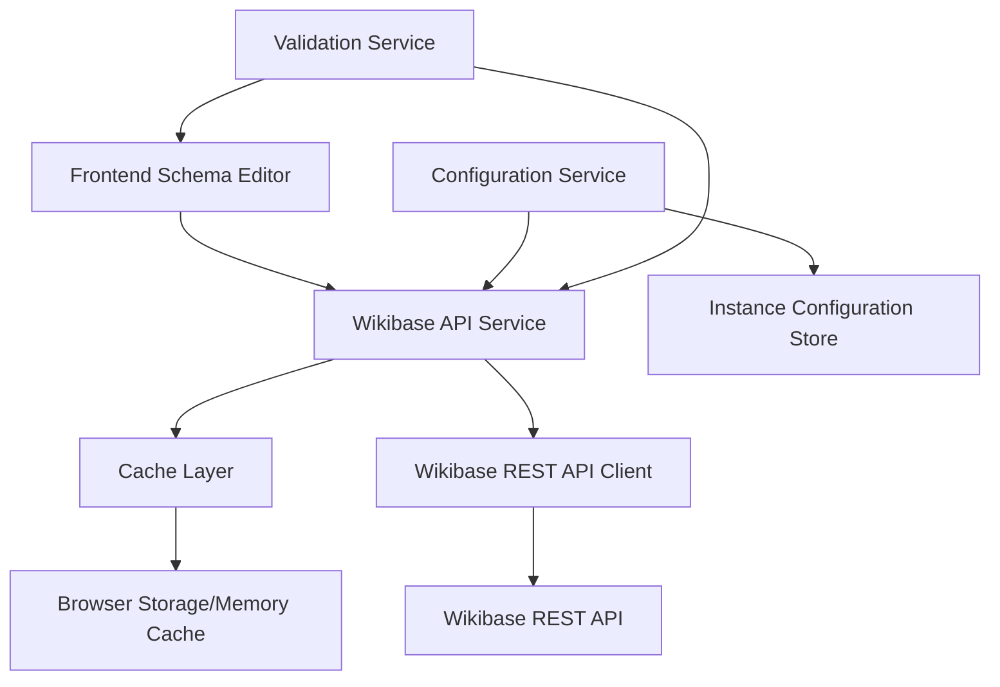

# Design Document

## Overview

This design outlines the integration of the Wikibase REST API using the @wmde/wikibase-rest-api package to enhance the existing wikibase schema editor with live data capabilities. The integration will provide real-time access to property information, constraints, validation rules, and other metadata from Wikibase instances, enabling users to work with accurate and current data when building schemas.

The solution leverages the auto-generated JavaScript client library that provides type-safe access to the Wikibase REST API endpoints, including properties, items, statements, labels, descriptions, and search functionality.

## Architecture

### High-Level Architecture



### Backend Integration Points

The integration will extend the existing backend API structure:

- **New API Routes**: `/api/wikibase/*` endpoints for proxy and caching
- **Service Layer**: Wikibase API service for managing client instances and requests
- **Cache Layer**: Redis-like caching for API responses and constraint data
- **Configuration**: Instance management for multiple Wikibase endpoints

### Frontend Integration Points

The integration will enhance the existing wikibase schema editor:

- **Enhanced Property Selector**: Live property search and selection
- **Real-time Validation**: Constraint-based validation feedback
- **Instance Switcher**: UI for selecting different Wikibase instances
- **Cache Management**: Client-side caching for improved performance

## Components and Interfaces

### Backend Components

#### 1. Wikibase API Service (`backend/src/services/wikibase-api.service.ts`)

```typescript
interface WikibaseApiService {
  // Client management
  createClient(instanceConfig: WikibaseInstanceConfig): WikibaseClient
  getClient(instanceId: string): WikibaseClient
  
  // Property operations
  searchProperties(instanceId: string, query: string, options?: SearchOptions): Promise<PropertySearchResult[]>
  getProperty(instanceId: string, propertyId: string): Promise<PropertyDetails>
  getPropertyConstraints(instanceId: string, propertyId: string): Promise<PropertyConstraint[]>
  
  // Item operations
  searchItems(instanceId: string, query: string, options?: SearchOptions): Promise<ItemSearchResult[]>
  getItem(instanceId: string, itemId: string): Promise<ItemDetails>
  
  // Data type operations
  getPropertyDataTypes(instanceId: string): Promise<PropertyDataTypeMap>
}
```

#### 2. Cache Service (`backend/src/services/wikibase-cache.service.ts`)

```typescript
interface WikibaseCacheService {
  get<T>(key: string): Promise<T | null>
  set<T>(key: string, value: T, ttl?: number): Promise<void>
  invalidate(pattern: string): Promise<void>
  
  // Specialized cache methods
  cachePropertyData(instanceId: string, propertyId: string, data: PropertyDetails): Promise<void>
  getCachedPropertyData(instanceId: string, propertyId: string): Promise<PropertyDetails | null>
}
```

#### 3. Configuration Service (`backend/src/services/wikibase-config.service.ts`)

```typescript
interface WikibaseConfigService {
  getInstances(): Promise<WikibaseInstanceConfig[]>
  getInstance(instanceId: string): Promise<WikibaseInstanceConfig>
  addInstance(config: WikibaseInstanceConfig): Promise<void>
  updateInstance(instanceId: string, config: Partial<WikibaseInstanceConfig>): Promise<void>
  validateInstance(config: WikibaseInstanceConfig): Promise<ValidationResult>
}
```

### Frontend Components

#### 1. Enhanced Property Selector (`frontend/src/features/wikibase-schema/components/LivePropertySelector.vue`)

```typescript
interface LivePropertySelectorProps {
  instanceId: string
  selectedProperty?: string
  dataTypeFilter?: string[]
  showConstraints?: boolean
}

interface LivePropertySelectorEmits {
  'property-selected': [property: PropertyDetails]
  'constraint-violation': [violations: ConstraintViolation[]]
}
```

#### 2. Instance Configuration Manager (`frontend/src/features/wikibase-schema/components/InstanceManager.vue`)

```typescript
interface InstanceManagerProps {
  currentInstanceId?: string
  allowCustomInstances?: boolean
}

interface InstanceManagerEmits {
  'instance-changed': [instanceId: string]
  'instance-added': [instance: WikibaseInstanceConfig]
}
```

#### 3. Real-time Validation Display (`frontend/src/features/wikibase-schema/components/LiveValidationDisplay.vue`)

```typescript
interface LiveValidationDisplayProps {
  propertyId: string
  instanceId: string
  currentValue: any
  showDetails?: boolean
}

interface ValidationResult {
  isValid: boolean
  violations: ConstraintViolation[]
  suggestions: string[]
}
```

### Frontend Composables

#### 1. Wikibase API Composable (`frontend/src/features/wikibase-schema/composables/useWikibaseApi.ts`)

```typescript
interface UseWikibaseApi {
  // Property operations
  searchProperties: (query: string, options?: SearchOptions) => Promise<PropertySearchResult[]>
  getProperty: (propertyId: string) => Promise<PropertyDetails>
  getPropertyConstraints: (propertyId: string) => Promise<PropertyConstraint[]>
  
  // Item operations  
  searchItems: (query: string, options?: SearchOptions) => Promise<ItemSearchResult[]>
  getItem: (itemId: string) => Promise<ItemDetails>
  
  // Instance management
  currentInstance: Ref<WikibaseInstanceConfig>
  availableInstances: Ref<WikibaseInstanceConfig[]>
  switchInstance: (instanceId: string) => Promise<void>
  
  // Loading states
  isLoading: Ref<boolean>
  error: Ref<string | null>
}
```

#### 2. Live Validation Composable (`frontend/src/features/wikibase-schema/composables/useLiveValidation.ts`)

```typescript
interface UseLiveValidation {
  validateProperty: (propertyId: string, value: any) => Promise<ValidationResult>
  validateStatement: (statement: StatementConfig) => Promise<ValidationResult>
  
  // Reactive validation
  validationResults: Ref<Map<string, ValidationResult>>
  isValidating: Ref<boolean>
  
  // Auto-validation
  enableAutoValidation: (enabled: boolean) => void
  validateOnChange: (propertyId: string, value: any) => void
}
```

## Data Models

### Core Data Types

```typescript
interface WikibaseInstanceConfig {
  id: string
  name: string
  baseUrl: string
  userAgent: string
  authToken?: string
  isDefault?: boolean
  metadata?: {
    description?: string
    language?: string
    version?: string
  }
}

interface PropertyDetails {
  id: string
  labels: Record<string, string>
  descriptions: Record<string, string>
  aliases: Record<string, string[]>
  dataType: string
  statements: Statement[]
  constraints?: PropertyConstraint[]
}

interface PropertyConstraint {
  type: string
  parameters: Record<string, any>
  description?: string
  violationMessage?: string
}

interface PropertySearchResult {
  id: string
  label: string
  description?: string
  dataType: string
  match: {
    type: 'label' | 'alias' | 'description'
    text: string
  }
}

interface ValidationResult {
  isValid: boolean
  violations: ConstraintViolation[]
  warnings: ConstraintWarning[]
  suggestions: string[]
}

interface ConstraintViolation {
  constraintType: string
  message: string
  severity: 'error' | 'warning'
  propertyId: string
  value?: any
}
```

### API Response Types

```typescript
interface ApiResponse<T> {
  data: T
  cached: boolean
  timestamp: string
  instanceId: string
}

interface SearchResponse<T> {
  results: T[]
  totalCount: number
  hasMore: boolean
  query: string
}
```

## Error Handling

### Error Categories

1. **Network Errors**: Connection failures, timeouts, rate limiting
2. **Authentication Errors**: Invalid tokens, permission issues
3. **Validation Errors**: Invalid property IDs, malformed requests
4. **Cache Errors**: Cache unavailability, corruption
5. **Configuration Errors**: Invalid instance configurations

### Error Handling Strategy

```typescript
interface WikibaseError extends Error {
  code: string
  instanceId?: string
  propertyId?: string
  retryable: boolean
  fallbackData?: any
}

// Error handling patterns
const handleApiError = (error: WikibaseError) => {
  switch (error.code) {
    case 'RATE_LIMITED':
      return scheduleRetry(error)
    case 'NETWORK_ERROR':
      return useCachedData(error)
    case 'INVALID_PROPERTY':
      return showValidationError(error)
    default:
      return showGenericError(error)
  }
}
```

### Fallback Mechanisms

- **Cached Data**: Use cached responses when API is unavailable
- **Graceful Degradation**: Disable live features when API fails
- **Retry Logic**: Exponential backoff for transient failures
- **User Feedback**: Clear error messages with suggested actions

## Testing Strategy

### Unit Testing

- **Service Layer**: Test API client wrapper methods
- **Cache Layer**: Test caching logic and invalidation
- **Validation Logic**: Test constraint validation algorithms
- **Composables**: Test reactive state management and API integration

### Integration Testing

- **API Endpoints**: Test backend proxy endpoints with mock Wikibase responses
- **Component Integration**: Test frontend components with mocked API responses
- **Cache Integration**: Test cache behavior with real cache backends
- **Error Scenarios**: Test error handling and fallback mechanisms

### End-to-End Testing

- **Property Search Flow**: Test complete property search and selection
- **Validation Flow**: Test real-time validation with constraint checking
- **Instance Switching**: Test switching between different Wikibase instances
- **Performance**: Test caching effectiveness and response times

### Testing Tools and Patterns

```typescript
// Mock Wikibase API responses
const mockPropertyResponse = {
  id: 'P31',
  labels: { en: 'instance of' },
  descriptions: { en: 'that class of which this subject is a particular example and member' },
  dataType: 'wikibase-item'
}

// Test API service methods
describe('WikibaseApiService', () => {
  test('should fetch property details with caching', async () => {
    const service = new WikibaseApiService()
    const property = await service.getProperty('wikidata', 'P31')
    expect(property.id).toBe('P31')
    expect(property.labels.en).toBe('instance of')
  })
})
```

### Performance Testing

- **API Response Times**: Measure response times for different query types
- **Cache Hit Rates**: Monitor cache effectiveness
- **Memory Usage**: Test memory consumption with large datasets
- **Concurrent Requests**: Test behavior under high load
