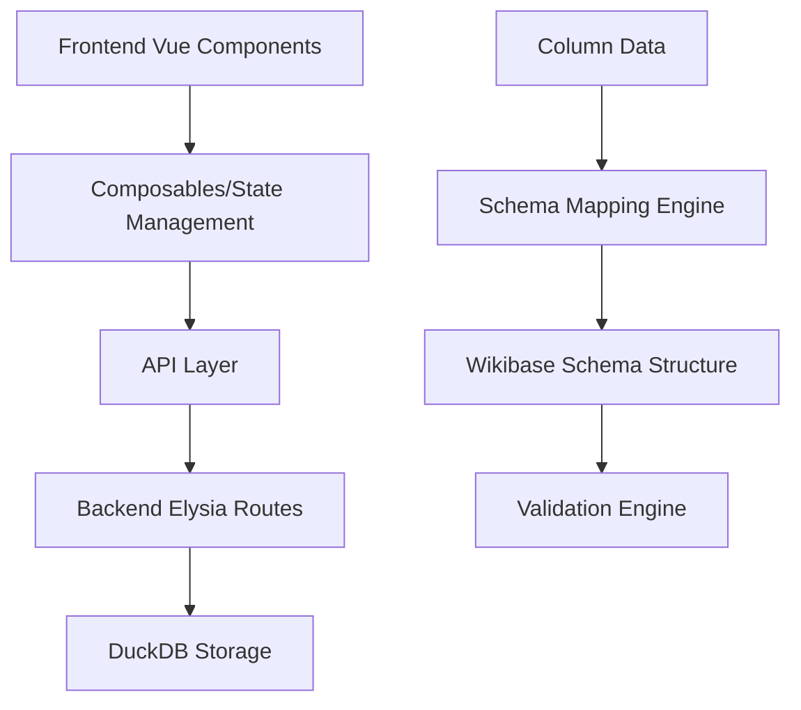
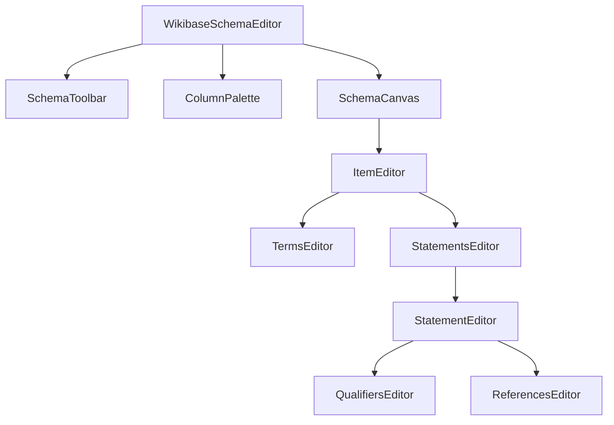

# Design Document: Wikibase Schema Editor

## Overview

The Wikibase Schema Editor is a visual interface that enables users to create mappings between tabular data columns and Wikibase item structures. The editor provides drag-and-drop functionality for mapping data columns to item Terms (Labels, Descriptions, Aliases) and Statements (property-value pairs with qualifiers and references). The design follows a component-based architecture using Vue 3 with TypeScript, integrating with the existing project structure and API endpoints.

## Architecture

### High-Level Architecture



### Component Architecture

The schema editor follows a hierarchical component structure:



## Components and Interfaces

### Core Components

#### 1. WikibaseSchemaEditor (Main Container)
- **Purpose**: Root component that orchestrates the entire schema editing experience
- **Responsibilities**:
  - Manages overall state and data flow
  - Coordinates drag-and-drop operations
  - Handles schema persistence
  - Provides validation feedback

#### 2. ColumnPalette
- **Purpose**: Displays available data columns as draggable elements
- **Responsibilities**:
  - Fetches column information from project data
  - Renders columns as draggable chips/badges
  - Provides visual feedback during drag operations
  - Shows column data types and sample values

#### 3. SchemaCanvas
- **Purpose**: Main editing area where schema structure is built
- **Responsibilities**:
  - Renders the item configuration interface
  - Manages drop zones for column mappings
  - Displays hierarchical schema structure
  - Handles visual feedback for valid/invalid mappings

#### 4. ItemEditor
- **Purpose**: Manages the configuration of a single Wikibase item
- **Responsibilities**:
  - Provides interface for item metadata
  - Coordinates Terms and Statements editors
  - Manages item-level validation
  - Handles item creation/deletion

#### 5. TermsEditor
- **Purpose**: Manages Labels, Descriptions, and Aliases configuration
- **Responsibilities**:
  - Provides drop zones for each term type
  - Manages multilingual configurations
  - Handles language code selection
  - Validates term mappings

#### 6. StatementsEditor
- **Purpose**: Container for managing multiple statements
- **Responsibilities**:
  - Provides interface to add/remove statements
  - Manages statement ordering
  - Coordinates individual statement editors

#### 7. StatementEditor
- **Purpose**: Configures individual property-value statements
- **Responsibilities**:
  - Property selection interface (P-ID autocomplete)
  - Value mapping configuration
  - Rank selection (preferred/normal/deprecated)
  - Data type validation

#### 8. QualifiersEditor & ReferencesEditor
- **Purpose**: Manages qualifiers and references for statements
- **Responsibilities**:
  - Provides interfaces to add/remove qualifiers/references
  - Property selection for qualifier/reference properties
  - Value mapping for qualifier/reference values

### Data Models

#### Schema Data Structure
```typescript
import { 
  ItemId, 
  PropertyId, 
  Labels, 
  Descriptions, 
  Aliases, 
  Claims, 
  Item 
} from '@backend/types/wikibase-schema'

interface WikibaseSchemaMapping {
  id: string
  projectId: string
  name: string
  wikibase: string
  item: ItemSchemaMapping
  createdAt: string
  updatedAt: string
}

interface ItemSchemaMapping {
  id?: ItemId
  terms: TermsSchemaMapping
  statements: StatementSchemaMapping[]
}

interface TermsSchemaMapping {
  labels: Record<string, ColumnMapping> // language code -> column mapping
  descriptions: Record<string, ColumnMapping>
  aliases: Record<string, ColumnMapping[]>
}

interface ColumnMapping {
  columnName: string
  dataType: string
  transformation?: TransformationRule
}

interface StatementSchemaMapping {
  id: string
  property: PropertyReference
  value: ValueMapping
  rank: StatementRank
  qualifiers: QualifierSchemaMapping[]
  references: ReferenceSchemaMapping[]
}

interface PropertyReference {
  id: PropertyId // P-ID using existing PropertyId type
  label?: string
  dataType: string
}

interface ValueMapping {
  type: 'column' | 'constant' | 'expression'
  source: ColumnMapping | string
  dataType: WikibaseDataType
}

interface QualifierSchemaMapping {
  property: PropertyReference
  value: ValueMapping
}

interface ReferenceSchemaMapping {
  property: PropertyReference
  value: ValueMapping
}

type StatementRank = 'preferred' | 'normal' | 'deprecated'

// Note: This should be imported from wikibase-sdk when available
// Currently the backend TODO indicates DataType needs to be defined
type WikibaseDataType = 
  | 'string' 
  | 'wikibase-item'
  | 'wikibase-property' 
  | 'quantity' 
  | 'time' 
  | 'globe-coordinate' 
  | 'url' 
  | 'external-id'
  | 'monolingualtext'
  | 'commonsMedia'
```

#### Drag and Drop Interface
```typescript
interface DragDropContext {
  draggedColumn: ColumnInfo | null
  dropTarget: DropTarget | null
  isValidDrop: boolean
}

interface ColumnInfo {
  name: string
  dataType: string
  sampleValues: string[]
  nullable: boolean
}

interface DropTarget {
  type: 'label' | 'description' | 'alias' | 'statement' | 'qualifier' | 'reference'
  path: string // JSON path to the target location
  acceptedTypes: WikibaseDataType[]
  language?: string
}
```

## Data Models

### Extended Wikibase Schema Types

Building on the existing `wikibase-schema.ts`, we'll extend the types to support schema mapping:

```typescript
// Schema mapping specific types
export interface SchemaMapping {
  item: ItemSchemaMapping
  columnMappings: Record<string, ColumnMapping>
  validationRules: ValidationRule[]
}

export interface ItemSchemaMapping {
  terms: {
    labels: Record<string, ColumnReference>
    descriptions: Record<string, ColumnReference>
    aliases: Record<string, ColumnReference[]>
  }
  statements: StatementSchemaMapping[]
}

export interface StatementSchemaMapping {
  property: PropertyId
  value: ValueSchemaMapping
  rank: StatementRank
  qualifiers: QualifierSchemaMapping[]
  references: ReferenceSchemaMapping[]
}

export interface ValueSchemaMapping {
  columnReference: ColumnReference
  dataType: WikibaseDataType
  transformation?: TransformationFunction
}

export interface ColumnReference {
  columnName: string
  dataType: string
  required: boolean
}

export type StatementRank = 'preferred' | 'normal' | 'deprecated'
```

## Error Handling

### Validation Strategy

The editor implements multi-level validation:

1. **Real-time Validation**: Immediate feedback during drag-and-drop operations
2. **Schema Validation**: Comprehensive validation before saving
3. **Data Type Validation**: Ensures column data types are compatible with Wikibase requirements
4. **Completeness Validation**: Checks for required fields and mappings

### Error Types

```typescript
interface ValidationError {
  type: 'warning' | 'error'
  code: string
  message: string
  path: string
  suggestions?: string[]
}

// Common validation errors
const ValidationErrors = {
  MISSING_REQUIRED_MAPPING: 'Required mapping is missing',
  INCOMPATIBLE_DATA_TYPE: 'Column data type incompatible with target',
  DUPLICATE_LANGUAGE_MAPPING: 'Multiple mappings for same language',
  INVALID_PROPERTY_ID: 'Invalid or non-existent property ID',
  MISSING_STATEMENT_VALUE: 'Statement missing required value mapping'
}
```

## Testing Strategy

### Unit Testing
- Component isolation testing using Vue Test Utils
- Composable logic testing
- Data transformation function testing
- Validation rule testing

### Integration Testing
- API endpoint testing for schema CRUD operations
- Database schema persistence testing
- End-to-end drag-and-drop workflow testing

### User Experience Testing
- Drag-and-drop interaction testing
- Responsive design testing
- Accessibility compliance testing
- Performance testing with large datasets

## Implementation Approach

### Phase 1: Core Infrastructure
- Set up base component structure
- Implement data models and TypeScript interfaces
- Create basic drag-and-drop functionality
- Establish API integration patterns

### Phase 2: Schema Building
- Implement Terms editor with multilingual support
- Create Statements editor with property selection
- Add basic validation and error handling
- Implement schema persistence

### Phase 3: Advanced Features
- Add Qualifiers and References support
- Implement advanced validation rules
- Add data type transformation capabilities
- Create preview and export functionality

### Phase 4: Polish and Optimization
- Enhance user experience with animations and feedback
- Optimize performance for large schemas
- Add comprehensive error handling
- Implement accessibility features

## Technical Decisions

### State Management
- Use Vue 3 Composition API with Pinia stores for state management
- Implement reactive schema state with automatic persistence
- Use computed properties for derived state (validation status, completion percentage)

### Drag and Drop Implementation
- Utilize HTML5 Drag and Drop API with Vue.Draggable for enhanced functionality
- Implement custom drop zone validation logic
- Provide visual feedback using CSS transitions and animations

### API Integration
- Extend existing Elysia backend routes for schema operations
- Implement optimistic updates with rollback capability
- Use Elysia Eden Treaty for type-safe API calls

This design provides a comprehensive foundation for implementing the Wikibase Schema Editor while maintaining consistency with the existing codebase architecture and ensuring scalability for future enhancements.
