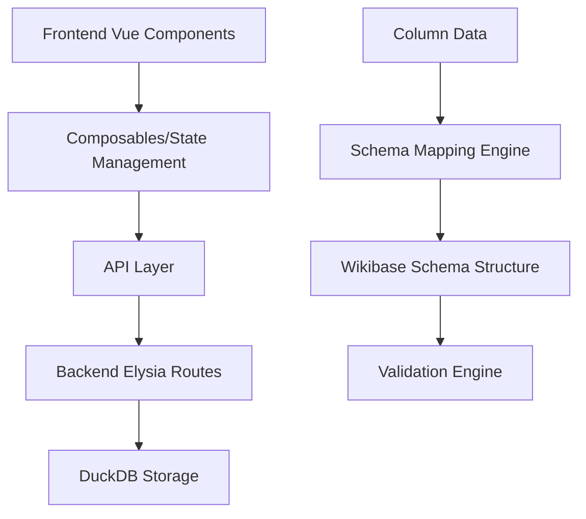
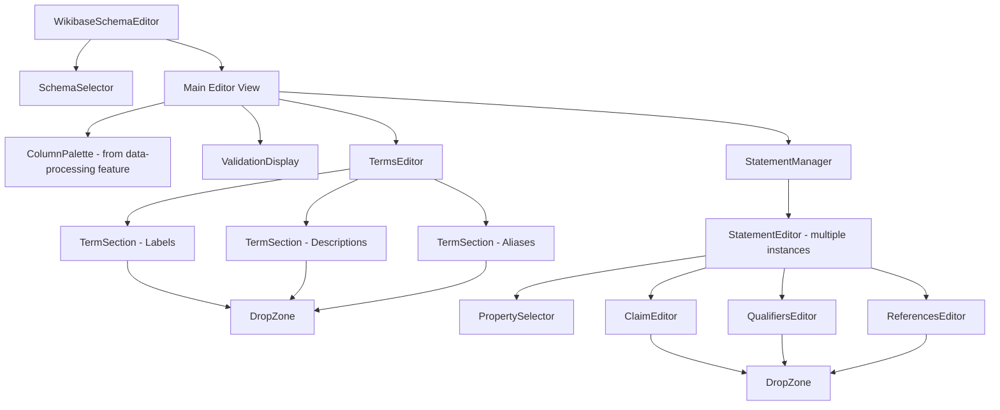

# Design Document: Wikibase Schema Editor

## Overview

The Wikibase Schema Editor is a comprehensive visual interface that enables users to create sophisticated mappings between tabular data columns and Wikibase item structures. The current implementation provides a complete schema management workflow including schema selection, detailed configuration, and persistence.

The editor features:

- **Schema Selection Interface**: Initial view for selecting existing schemas or creating new ones
- **Drag-and-Drop Mapping**: Intuitive column-to-schema mapping with real-time validation
- **Comprehensive Configuration**: Full support for Terms, Statements, Qualifiers, and References
- **Always-Active Validation**: Immediate feedback during drag operations and configuration
- **Autosave Architecture**: Local changes saved immediately with manual backend persistence
- **Reusable Components**: Consistent DropZone, PropertySelector, and validation components

The implementation uses Vue 3 with Composition API, TypeScript for type safety, Pinia for reactive state management, and integrates with a full-featured Elysia backend API. The architecture emphasizes component reusability, immediate user feedback, and robust error handling.

## Architecture

### High-Level Architecture



### Component Architecture

The schema editor follows a hierarchical component structure with clear separation between schema selection and main editing:



## Components and Interfaces

### Core Components

#### 1. WikibaseSchemaEditor (Main Container)

- **Purpose**: Root component that orchestrates the entire schema editing experience with autosave functionality
- **Responsibilities**:
  - Manages overall state and data flow with automatic Pinia store updates
  - Coordinates between SchemaSelector and main editor views
  - Uses existing manual persistence layer save button for backend synchronization
  - Provides validation feedback through ValidationDisplay component
  - Manages schema selection and creation workflow
  - Eliminates individual save/cancel buttons throughout the interface

#### 2. SchemaSelector

- **Purpose**: Initial interface for schema selection and management
- **Responsibilities**:
  - Fetches existing schemas using useSchemaApi composable
  - Displays schemas with metadata (name, dates, completion status, statement/term counts)
  - Provides "Create New Schema" functionality
  - Handles schema deletion with confirmation dialogs
  - Shows empty state when no schemas exist
  - Transitions to main editor upon schema selection or creation

#### 3. ColumnPalette (from data-processing feature)

- **Purpose**: Displays available data columns as draggable elements with sample data toggle
- **Responsibilities**:
  - Located in `frontend/src/features/data-processing/components/ColumnPalette.vue`
  - Renders columns from `projectStore.columnsForSchema` as draggable chips
  - Provides sample data visibility toggle (hidden by default)
  - Shows column data types with icons and severity indicators
  - Handles drag start/end events with HTML5 drag and drop API
  - Integrates with validation system for immediate dragstart validation

#### 4. ValidationDisplay

- **Purpose**: Shows current validation status and detailed error information
- **Responsibilities**:
  - Displays error and warning counts in the toolbar
  - Shows detailed validation messages with paths and suggestions
  - Provides "Clear All" functionality for validation errors
  - Updates immediately when validation status changes
  - Integrates with useValidationStore for reactive validation state

#### 5. TermsEditor

- **Purpose**: Container for three TermSection components (Labels, Descriptions, Aliases)
- **Responsibilities**:
  - Renders three TermSection components with different configurations
  - Coordinates term-level validation and feedback
  - Manages the overall terms editing workflow

#### 6. TermSection

- **Purpose**: Unified interface for configuring individual term types with language selection
- **Responsibilities**:
  - Provides language selector with accepted language codes
  - Renders DropZone component for column mapping
  - Displays existing mappings with remove functionality
  - Handles data type validation for term-specific constraints
  - Shows validation status with visual indicators
  - Integrates with schema store for immediate autosave

#### 7. StatementManager

- **Purpose**: Container for managing multiple StatementEditor instances
- **Responsibilities**:
  - Provides "Add Statement" functionality
  - Renders multiple StatementEditor components
  - Shows statement count in header
  - Displays empty state when no statements exist
  - Coordinates statement-level operations

#### 8. StatementEditor

- **Purpose**: Comprehensive interface for configuring individual statements
- **Responsibilities**:
  - Integrates PropertySelector for property selection
  - Uses ClaimEditor for value, rank, qualifiers, and references configuration
  - Provides statement-level actions (move up/down, remove)
  - Handles new statement creation workflow
  - Validates statement completeness (requires property selection)

#### 9. PropertySelector

- **Purpose**: Search and selection interface for Wikibase properties
- **Responsibilities**:
  - Provides autocomplete search for property IDs and labels
  - Displays selected property information (ID, label, data type)
  - Emits update events when property selection changes
  - Shows disabled state when no property is selected
  - Integrates with Wikibase property data

#### 10. ClaimEditor

- **Purpose**: Comprehensive interface for statement values, ranks, qualifiers, and references
- **Responsibilities**:
  - Provides value mapping configuration with DropZone integration
  - Manages statement rank selection (preferred/normal/deprecated)
  - Coordinates QualifiersEditor and ReferencesEditor components
  - Handles data type validation for statement values
  - Disabled state management based on property selection

#### 11. DropZone

- **Purpose**: Reusable drag-and-drop target component with validation
- **Responsibilities**:
  - Provides consistent drop target interface across the application
  - Handles HTML5 drag and drop events (dragover, dragenter, dragleave, drop)
  - Validates dropped columns against accepted data types
  - Shows visual feedback during drag operations (valid/invalid states)
  - Emits column-dropped events with validated column information
  - Supports custom validator functions for additional validation logic

#### 12. QualifiersEditor & ReferencesEditor

- **Purpose**: Specialized editors for statement qualifiers and references
- **Responsibilities**:
  - Provides add/remove functionality for qualifiers and references
  - Integrates PropertySelector for qualifier/reference property selection
  - Uses DropZone components for value mapping
  - Manages complex reference structures with multiple snaks
  - Handles immediate autosave for all qualifier and reference operations

### Data Models

#### Schema Data Structure

The current implementation uses TypeScript interfaces that align with the backend API schemas:

```typescript
// Main schema mapping structure (from backend API)
interface WikibaseSchemaResponse {
  id: UUID
  project_id: UUID
  name: string
  wikibase: string
  schema: ItemSchema
  created_at: string
  updated_at: string
}

// Frontend schema mapping type
interface WikibaseSchemaMapping {
  id: UUID
  projectId: UUID
  name: string
  wikibase: string
  schema: ItemSchema
  createdAt: string
  updatedAt: string
}

// Item schema structure
interface ItemSchema {
  id?: ItemId
  terms: TermsSchemaMapping
  statements: StatementSchemaMapping[]
}

// Terms configuration
interface TermsSchemaMapping {
  labels: Label // Record<string, ColumnMapping>
  descriptions: Label // Record<string, ColumnMapping>
  aliases: Alias // Record<string, ColumnMapping[]>
}

// Column mapping for data transformation
interface ColumnMapping {
  columnName: string
  dataType: string
  transformation?: TransformationRule
}

// Statement configuration
interface StatementSchemaMapping {
  id: UUID
  property: PropertyReference
  value: ValueMapping
  rank: StatementRank
  qualifiers: PropertyValueMap[]
  references: ReferenceSchemaMapping[]
}

// Property reference
interface PropertyReference {
  id: PropertyId // P-ID format (e.g., "P31")
  label?: string
  dataType: string
}

// Value mapping types
type ValueMapping =
  | { type: 'column'; source: ColumnMapping; dataType: WikibaseDataType }
  | { type: 'constant'; source: string; dataType: WikibaseDataType }
  | { type: 'expression'; source: string; dataType: WikibaseDataType }

// Property-value mapping for qualifiers and references
interface PropertyValueMap {
  id: UUID
  property: PropertyReference
  value: ValueMapping
}

// Reference structure with multiple snaks
interface ReferenceSchemaMapping {
  id: UUID
  snaks: PropertyValueMap[]
}

// Statement rank options
type StatementRank = 'preferred' | 'normal' | 'deprecated'

// Wikibase data types
type WikibaseDataType =
  | 'string'
  | 'wikibase-item'
  | 'wikibase-property'
  | 'quantity'
  | 'time'
  | 'globe-coordinate'
  | 'url'
  | 'external-id'
  | 'monolingualtext'
  | 'commonsMedia'

// Schema store structure (dual statement storage)
interface SchemaStoreState {
  // Basic schema metadata
  schemaId: UUID | null
  projectId: UUID | null
  schemaName: string
  wikibase: string
  itemId: ItemId | null

  // Terms storage
  labels: Label
  descriptions: Label
  aliases: Alias

  // Dual statement storage approach
  statements: StatementSchemaMapping[] // Array format for API
  statements1: Record<UUID, StatementSchema> // Object format for editing

  // Meta state
  isLoading: boolean
  isDirty: boolean
  lastSaved: Date | null
}

// Statement schema for editing (partial with required id)
interface StatementSchema {
  id: UUID
  property?: PropertyReference
  value?: ValueMapping
  rank: StatementRank
  qualifiers?: PropertyValueMap[]
  references?: ReferenceSchemaMapping[]
}
```

#### Schema Editor Drag and Drop Integration

```typescript
// Schema editor specific drag and drop context
interface SchemaDragDropContext {
  // Global drag state (from Pinia store)
  draggedColumn: Ref<ColumnInfo | null>
  dragState: Ref<DragState>

  // Drop zone state from native HTML5 events
  isOverDropZone: Ref<boolean>
  hoveredTarget: Ref<string | null>

  // Validation and feedback (always active)
  validDropTargets: ComputedRef<DropTarget[]>
  isValidDrop: ComputedRef<boolean>
  dropFeedback: Ref<DropFeedback | null>
}

// Native HTML5 drag and drop integration for drop targets
interface DropZoneConfig {
  onDrop: (event: DragEvent) => void
  onDragEnter?: (event: DragEvent) => void
  onDragLeave?: (event: DragEvent) => void
  onDragOver?: (event: DragEvent) => void
  acceptedDataTypes: string[]
  validateDrop?: (data: string) => boolean
}

interface DropFeedback {
  type: 'success' | 'error' | 'warning'
  message: string
  suggestions?: string[]
}

interface ColumnInfo {
  name: string
  dataType: string
  sampleValues: string[]
  nullable: boolean
  uniqueCount?: number
}

interface DropTarget {
  type: 'label' | 'description' | 'alias' | 'statement' | 'qualifier' | 'reference'
  path: string // JSON path to the target location
  acceptedTypes: WikibaseDataType[]
  language?: string
  propertyId?: string
  isRequired?: boolean
}
```

## Data Models

### Extended Wikibase Schema Types

Building on the existing `wikibase-schema.ts`, we'll extend the types to support schema mapping:

```typescript
// Schema mapping specific types
export interface SchemaMapping {
  item: ItemSchemaMapping
  columnMappings: Record<string, ColumnMapping>
  validationRules: ValidationRule[]
}

export interface ItemSchemaMapping {
  terms: {
    labels: Record<string, ColumnReference>
    descriptions: Record<string, ColumnReference>
    aliases: Record<string, ColumnReference[]>
  }
  statements: StatementSchemaMapping[]
}

export interface StatementSchemaMapping {
  property: PropertyId
  value: ValueSchemaMapping
  rank: StatementRank
  qualifiers: QualifierSchemaMapping[]
  references: ReferenceSchemaMapping[]
}

export interface ValueSchemaMapping {
  columnReference: ColumnReference
  dataType: WikibaseDataType
  transformation?: TransformationFunction
}

export interface ColumnReference {
  columnName: string
  dataType: string
  required: boolean
}

export type StatementRank = 'preferred' | 'normal' | 'deprecated'
```

## Error Handling

### Validation Strategy

The editor implements multi-level validation:

1. **Drag Validation**: Immediate feedback during drag-and-drop operations, triggered on dragstart
2. **Schema Validation**: Comprehensive validation before saving
3. **Data Type Validation**: Ensures column data types are compatible with Wikibase requirements
4. **Completeness Validation**: Checks for required fields and mappings

The validation system is always active and does not require manual start/stop operations. Individual validation rules can be enabled or disabled, but the validation workflow itself runs continuously.

### Error Types

```typescript
interface ValidationError {
  type: 'warning' | 'error'
  code: string
  message: string
  path: string
  suggestions?: string[]
}

// Common validation errors
const ValidationErrors = {
  MISSING_REQUIRED_MAPPING: 'Required mapping is missing',
  INCOMPATIBLE_DATA_TYPE: 'Column data type incompatible with target',
  DUPLICATE_LANGUAGE_MAPPING: 'Multiple mappings for same language',
  INVALID_PROPERTY_ID: 'Invalid or non-existent property ID',
  MISSING_STATEMENT_VALUE: 'Statement missing required value mapping',
}
```

## Testing Strategy

### Unit Testing

- Component isolation testing using Vue Test Utils
- Composable logic testing
- Data transformation function testing
- Validation rule testing

### Integration Testing

- API endpoint testing for schema CRUD operations
- Database schema persistence testing
- End-to-end drag-and-drop workflow testing

### User Experience Testing

- Drag-and-drop interaction testing
- Responsive design testing
- Accessibility compliance testing
- Performance testing with large datasets

## Implementation Approach

### Phase 1: Core Infrastructure

- Set up base component structure
- Implement data models and TypeScript interfaces
- Create basic drag-and-drop functionality
- Establish API integration patterns

### Phase 2: Schema Building

- Implement Terms editor with multilingual support
- Create Statements editor with property selection
- Add basic validation and error handling
- Implement schema persistence

### Phase 3: Advanced Features

- Add Qualifiers and References support
- Implement advanced validation rules
- Add data type transformation capabilities
- Create preview and export functionality

### Phase 4: Polish and Optimization

- Enhance user experience with animations and feedback
- Optimize performance for large schemas
- Add comprehensive error handling
- Implement accessibility features

### Phase 5: Schema Selection Enhancement

- Build SchemaSelector component for initial schema selection
- Integrate schema selection with existing WikibaseSchemaEditor
- Add schema metadata display and empty state handling
- Ensure seamless transition between selection and main editor

## Technical Decisions

### State Management

The current implementation uses a sophisticated state management approach:

#### Pinia Store Architecture

- **useSchemaStore**: Main store for schema data with dual statement storage
  - `statements`: Array format for API compatibility
  - `statements1`: Object format for efficient editing operations
  - Immediate autosave on all mutations (markDirty() called automatically)
  - Computed properties for derived state (canSave, hasStatements, countStatements)

- **useValidationStore**: Dedicated store for validation state
  - Always-active validation triggered on dragstart events
  - Path-based error tracking for precise error location
  - Reactive error and warning counts

- **useDragDropStore**: Shared store for drag-and-drop operations
  - Global drag state management across components
  - Valid drop target calculation based on column data types
  - Integration with validation system for immediate feedback

#### Autosave Implementation

- **Local Store Autosave**: Every user interaction immediately updates Pinia store
  - All mutations call `markDirty()` to track changes
  - No individual save/cancel buttons throughout interface
  - Optimistic updates with immediate UI feedback

- **Backend Persistence**: Manual "Save to Server" button in toolbar
  - Uses `useSchemaApi` composable for API operations
  - Transforms `statements1` object to `statements` array for API
  - Provides loading states and error handling
  - Calls `markAsSaved()` on successful persistence

### Autosave Architecture

The autosave system operates on two levels:

1. **Local Store Autosave**: Every user interaction immediately updates the Pinia store
   - Drop operations save mappings instantly
   - Property selections save immediately
   - Rank changes save automatically
   - Language selections save instantly
   - All CRUD operations on Terms, Statements, Qualifiers, and References save immediately

2. **Backend Persistence Layer**: Existing manual toolbar button for server synchronization
   - Existing "Save to Server" button in main toolbar (unchanged)
   - Uses current implementation to save Pinia store state to backend API
   - Provides success/error feedback using existing implementation
   - Retains local changes on failure for retry using current behavior
   - No individual save buttons throughout the interface
   - No changes to existing manual backend synchronization behavior

### Schema Selection Integration

- SchemaSelector will be the initial view within WikibaseSchemaEditor
- Use existing `useSchemaApi().loadAllSchemas()` to fetch available schemas
- Transition to main editor by setting a reactive state flag
- Leverage existing schema initialization code for new schema creation

### Drag and Drop Implementation

The current implementation uses a hybrid approach combining VueUse reactivity with native HTML5 drag and drop:

#### Column Dragging (ColumnPalette)

- **VueUse Integration**: Uses `UseDraggable` component for visual feedback and position tracking
- **HTML5 DataTransfer**: Uses native `dragstart`/`dragend` events for data transfer
- **Data Format**: Transfers column information as JSON in `application/x-column-data` format
- **Store Integration**: Updates `useDragDropStore` on drag start/end for global state management

#### Drop Zone Implementation (DropZone Component)

- **Native HTML5 Events**: Uses `dragover`, `dragenter`, `dragleave`, `drop` events
- **Validation Integration**: Immediate validation on drag operations using `useValidation` composable
- **Visual Feedback**: CSS classes for valid/invalid drop states (`drop-zone-valid`, `drop-zone-invalid`)
- **Event Handling**: Prevents default behavior and sets appropriate `dropEffect`

#### Validation System

- **Always Active**: Validation triggers automatically on `dragstart` events
- **Immediate Feedback**: Uses `triggerDragStartValidation()` for synchronous validation
- **Data Type Compatibility**: Validates column data types against target accepted types
- **Path-Based Errors**: Tracks validation errors by schema path for precise error location

#### Implementation Pattern

```typescript
// Column drag start (ColumnPalette)
const handleDragStart = (event: DragEvent, columnInfo: ColumnInfo) => {
  // Set HTML5 drag data
  event.dataTransfer?.setData('application/x-column-data', JSON.stringify(columnInfo))

  // Update global drag state
  dragDropStore.startDrag(columnInfo)

  // Trigger immediate validation
  triggerDragStartValidation(columnInfo)
}

// Drop zone handling (DropZone)
const handleDrop = (event: DragEvent) => {
  const columnData = event.dataTransfer?.getData('application/x-column-data')
  const column = JSON.parse(columnData)

  if (validateColumnDrop(column)) {
    emit('column-dropped', column)
  }
}
```

### API Integration

The current implementation provides comprehensive API integration through the `useSchemaApi` composable:

#### Backend Routes (Elysia)

- **GET** `/api/project/:projectId/schemas` - List all schemas for a project
- **POST** `/api/project/:projectId/schemas` - Create new schema
- **GET** `/api/project/:projectId/schemas/:schemaId` - Get specific schema
- **PUT** `/api/project/:projectId/schemas/:schemaId` - Update schema
- **DELETE** `/api/project/:projectId/schemas/:schemaId` - Delete schema

#### API Composable Functions

```typescript
// useSchemaApi composable provides:
const {
  loadSchema, // Load specific schema by ID
  loadAllSchemas, // Load all schemas for project
  createSchema, // Create new schema
  updateSchema, // Update existing schema
  deleteSchema, // Delete schema
  saveSchema, // Smart save (create or update)
  canSave, // Computed save eligibility
  isSaving, // Loading state
  saveStatus, // Success/error status
} = useSchemaApi()
```

#### Data Transformation

- **Frontend to API**: Transforms `statements1` object to `statements` array format
- **API to Frontend**: Parses JSON schema field and loads into store structure
- **Type Safety**: Uses Elysia Eden Treaty for fully typed API calls
- **Error Handling**: Comprehensive error handling with user-friendly messages

#### Persistence Strategy

- **Optimistic Updates**: Immediate UI updates with store mutations
- **Manual Sync**: "Save to Server" button for backend persistence
- **Rollback Capability**: Maintains local changes on API failures
- **Loading States**: Provides loading indicators during API operations

### Autosave Implementation Patterns

#### Component-Level Autosave

```typescript
// Example: TermsEditor autosave pattern
const handleTermMapping = (termType: string, language: string, columnMapping: ColumnMapping) => {
  // Immediately update Pinia store - no save button needed
  schemaStore.updateTermMapping(termType, language, columnMapping)

  // Mark schema as dirty for backend sync
  schemaStore.markDirty()
}

// Example: StatementEditor autosave pattern
const handlePropertySelection = (statementId: string, property: PropertyReference) => {
  // Immediately update Pinia store - no save button needed
  schemaStore.updateStatementProperty(statementId, property)

  // Mark schema as dirty for backend sync
  schemaStore.markDirty()
}
```

#### Store-Level Autosave

```typescript
// Pinia store with autosave mutations
export const useSchemaStore = defineStore('schema', () => {
  const schema = ref<WikibaseSchemaMapping | null>(null)

  const updateTermMapping = (termType: string, language: string, mapping: ColumnMapping) => {
    if (!schema.value) return

    // Immediate store update
    schema.value.item.terms[termType][language] = mapping
    schema.value.isDirty = true
    schema.value.updatedAt = new Date().toISOString()
  }

  const markDirty = () => {
    if (schema.value) {
      schema.value.isDirty = true
    }
  }

  // Note: Backend sync functionality already exists and should not be modified
  // The existing manual "Save to Server" implementation will read from the
  // autosave-updated store state without requiring changes to sync logic

  return {
    schema: readonly(schema),
    updateTermMapping,
    markDirty,
    // Note: syncToBackend already exists in current implementation
  }
})
```

#### UI Patterns Without Save/Cancel Buttons

- Drop zones immediately apply mappings on drop
- Property selectors immediately update on selection
- Rank dropdowns immediately update on change
- Language selectors immediately update on change
- Add/remove buttons immediately modify arrays
- No confirmation dialogs for individual operations
- Existing manual "Save to Server" button in main toolbar remains unchanged

### Auto-Imports Configuration

The frontend uses `unplugin-auto-import` for seamless development experience:

```typescript
// vite.config.ts - Auto-imports configuration
AutoImport({
  imports: [
    'vue', // ref, computed, watch, etc.
    'vue-router', // useRoute, useRouter, etc.
    'pinia', // defineStore, storeToRefs, etc.
    '@vueuse/core', // useDraggable, useDropZone, etc.
  ],
  dirs: ['src/**'], // Auto-import from composables and stores
  vueTemplate: true, // Enable in Vue templates
})
```

**Available Auto-Imports:**

- **Vue 3**: `ref`, `computed`, `watch`, `useTemplateRef`, `nextTick`, etc.
- **Vue Router**: `useRoute`, `useRouter`, `useRouteParams`, etc.
- **Pinia**: `defineStore`, `storeToRefs`, `useProjectStore`, etc.
- **VueUse**: `useDraggable`, `useDropZone`, `useEventListener`, etc.
- **Custom Composables**: All composables from `src/composables/`
- **Stores**: All stores from `src/stores/`
- **Types**: All types from `src/types/` are globally available

## VueUse Implementation Details

### ColumnPalette Container with Sample Data Toggle

```vue
<!-- ColumnPalette.vue - Container component with sample data toggle -->
<script setup lang="ts">
// Note: Vue, VueUse, and PrimeVue components are auto-imported
// No need to import: ref, computed, Button, etc.

const props = defineProps<{
  columns: ColumnInfo[]
}>()

// Sample data visibility state (hidden by default)
const showSampleData = ref(false)

const toggleSampleData = () => {
  showSampleData.value = !showSampleData.value
}
</script>

<template>
  <div class="column-palette">
    <!-- Toggle button at the top -->
    <div class="flex justify-between items-center mb-4">
      <h3 class="text-lg font-semibold">Columns</h3>
      <Button
        :icon="showSampleData ? 'pi pi-eye-slash' : 'pi pi-eye'"
        :label="showSampleData ? 'Hide Samples' : 'Show Samples'"
        size="small"
        severity="secondary"
        @click="toggleSampleData"
      />
    </div>

    <!-- Column items -->
    <div class="flex flex-wrap gap-2">
      <ColumnItem
        v-for="column in columns"
        :key="column.name"
        :column-info="column"
        :show-sample-data="showSampleData"
      />
    </div>
  </div>
</template>
```

### Column Dragging with UseDraggable Component and HTML5 DataTransfer

```vue
<!-- ColumnItem.vue - Individual draggable column component -->
<script setup lang="ts">
// Note: Vue, VueUse, and PrimeVue components are auto-imported
// No need to import: ref, computed, Chip, etc.

const props = defineProps<{
  columnInfo: ColumnInfo
  showSampleData: boolean
}>()

const dragDropStore = useDragDropStore() // Auto-imported from stores

// HTML5 drag and drop for data transfer
const handleDragStart = (event: DragEvent) => {
  // Set column data in DataTransfer for drop zones to access
  event.dataTransfer?.setData('application/x-column-data', JSON.stringify(props.columnInfo))
  event.dataTransfer?.setData('text/plain', props.columnInfo.name) // Fallback

  // Set drag effect
  if (event.dataTransfer) {
    event.dataTransfer.effectAllowed = 'copy'
  }

  // Set dragged column data in store
  dragDropStore.startDrag(props.columnInfo)
}

const handleDragEnd = (event: DragEvent) => {
  // Clean up drag state
  dragDropStore.endDrag()
}
</script>

<template>
  <UseDraggable
    v-slot="{ isDragging }"
    :initial-value="{ x: 0, y: 0 }"
    :prevent-default="true"
  >
    <div
      :class="{
        'is-dragging': isDragging,
        'opacity-50': isDragging,
      }"
      class="column-chip cursor-grab active:cursor-grabbing"
      draggable="true"
      @dragstart="handleDragStart"
      @dragend="handleDragEnd"
    >
      <Chip
        :label="columnInfo.name"
        class="mb-2"
      >
        <template #default>
          <div class="flex items-center gap-2">
            <span class="font-medium">{{ columnInfo.name }}</span>
            <Chip
              :label="columnInfo.dataType"
              size="small"
              severity="secondary"
            />
          </div>
        </template>
      </Chip>

      <div
        v-if="showSampleData && columnInfo.sampleValues?.length"
        class="text-xs text-surface-600 mt-1"
      >
        Sample: {{ columnInfo.sampleValues.slice(0, 3).join(', ') }}
        <span v-if="columnInfo.sampleValues.length > 3">...</span>
      </div>
    </div>
  </UseDraggable>
</template>
```

### Drop Zones with Native HTML5 Events

```vue
<!-- TermsEditor.vue - Creating drop zones for labels/descriptions -->
<script setup lang="ts">
// Note: Vue, VueUse, and Pinia composables are auto-imported
// No need to import: ref, useTemplateRef, etc.

const labelDropZone = useTemplateRef<HTMLElement>('labelDropZone')
const dragDropStore = useDragDropStore() // Auto-imported from stores
const isOverLabelZone = ref(false)

// Handle drag events
const handleDragOver = (event: DragEvent) => {
  event.preventDefault() // Allow drop
  event.dataTransfer!.dropEffect = 'copy'
}

const handleDragEnter = (event: DragEvent) => {
  event.preventDefault()
  isOverLabelZone.value = true

  // Get column data from drag operation
  const columnData = event.dataTransfer?.getData('application/x-column-data')
  if (columnData) {
    const column = JSON.parse(columnData)
    // Visual feedback based on validation
    if (isValidDropForLabels(column)) {
      event.currentTarget?.classList.add('drop-zone-valid')
    } else {
      event.currentTarget?.classList.add('drop-zone-invalid')
    }
  }
}

const handleDragLeave = (event: DragEvent) => {
  isOverLabelZone.value = false
  // Remove visual feedback
  event.currentTarget?.classList.remove('drop-zone-valid', 'drop-zone-invalid')
}

const handleDrop = (event: DragEvent) => {
  event.preventDefault()
  isOverLabelZone.value = false

  // Get the column data from the drag operation
  const columnData = event.dataTransfer?.getData('application/x-column-data')
  if (columnData) {
    const column = JSON.parse(columnData)
    if (isValidDropForLabels(column)) {
      handleColumnDrop('label', column, 'en')
    }
  }

  // Clean up visual feedback
  event.currentTarget?.classList.remove('drop-zone-valid', 'drop-zone-invalid')
}
</script>

<template>
  <div
    ref="labelDropZone"
    :class="{
      'drop-zone-active': isOverLabelZone,
      'drop-zone-valid': isValidDropForLabels(dragDropStore.draggedColumn),
      'drop-zone-invalid':
        dragDropStore.draggedColumn && !isValidDropForLabels(dragDropStore.draggedColumn),
    }"
    class="label-drop-zone"
    @dragover="handleDragOver"
    @dragenter="handleDragEnter"
    @dragleave="handleDragLeave"
    @drop="handleDrop"
  >
    <span v-if="!labelMapping">Drop column for labels</span>
    <ColumnMapping
      v-else
      :mapping="labelMapping"
    />
  </div>
</template>
```

### Validation and Feedback System

```typescript
// useValidation.ts - Composable for drag validation (always active)
// Note: Vue composables are auto-imported (ref, computed, etc.)
export function useValidation() {
  const draggedColumn = ref<ColumnInfo | null>(null)

  const isValidDropForLabels = (column: ColumnInfo | null): boolean => {
    if (!column) return false
    // Labels accept string-like data types
    return ['VARCHAR', 'TEXT', 'STRING'].includes(column.dataType.toUpperCase())
  }

  const isValidDropForStatements = (
    column: ColumnInfo | null,
    propertyDataType: WikibaseDataType,
  ): boolean => {
    if (!column) return false

    const compatibilityMap: Record<WikibaseDataType, string[]> = {
      string: ['VARCHAR', 'TEXT', 'STRING'],
      quantity: ['INTEGER', 'DECIMAL', 'NUMERIC', 'FLOAT'],
      time: ['DATE', 'DATETIME', 'TIMESTAMP'],
      'wikibase-item': ['VARCHAR', 'TEXT'], // Assuming item IDs as strings
      url: ['VARCHAR', 'TEXT'],
      // ... more mappings
    }

    return compatibilityMap[propertyDataType]?.includes(column.dataType.toUpperCase()) ?? false
  }

  const getDropFeedback = (
    column: ColumnInfo | null,
    targetType: DropTargetType,
  ): DropFeedback | null => {
    if (!column) return null

    switch (targetType) {
      case 'label':
        return isValidDropForLabels(column)
          ? { type: 'success', message: 'Valid mapping for labels' }
          : {
              type: 'error',
              message: 'Invalid data type for labels',
              suggestions: ['Use text-based columns for labels'],
            }
      // ... more cases
    }
  }

  // Validation is always active - no start/stop methods needed

  return {
    draggedColumn,
    isValidDropForLabels,
    isValidDropForStatements,
    getDropFeedback,
  }
}
```

### Global Drag State Management

```typescript
// stores/dragDrop.ts - Pinia store for drag state with automatic validation
export const useDragDropStore = defineStore('dragDrop', () => {
  const draggedColumn = ref<ColumnInfo | null>(null)
  const dragState = ref<DragState>('idle')
  const validDropTargets = ref<string[]>([])
  const hoveredTarget = ref<string | null>(null)

  const startDrag = (column: ColumnInfo) => {
    draggedColumn.value = column
    dragState.value = 'dragging'
    // Calculate valid drop targets based on column data type
    // Validation is automatically triggered by this state change
    validDropTargets.value = calculateValidTargets(column)
  }

  const endDrag = () => {
    draggedColumn.value = null
    dragState.value = 'idle'
    validDropTargets.value = []
    hoveredTarget.value = null
  }

  const setHoveredTarget = (targetPath: string | null) => {
    hoveredTarget.value = targetPath
  }

  return {
    draggedColumn: readonly(draggedColumn),
    dragState: readonly(dragState),
    validDropTargets: readonly(validDropTargets),
    hoveredTarget: readonly(hoveredTarget),
    startDrag,
    endDrag,
    setHoveredTarget,
  }
})
```

This design provides a comprehensive foundation for implementing the Wikibase Schema Editor using VueUse's drag and drop composables, maintaining consistency with the existing codebase architecture and ensuring scalability for future enhancements.
