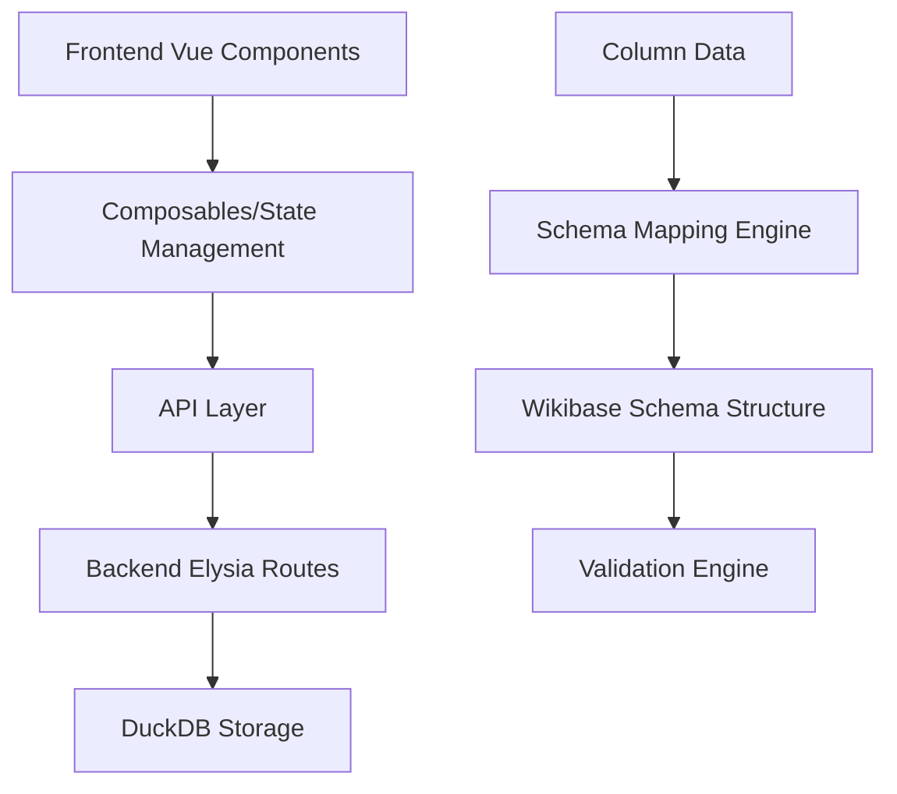
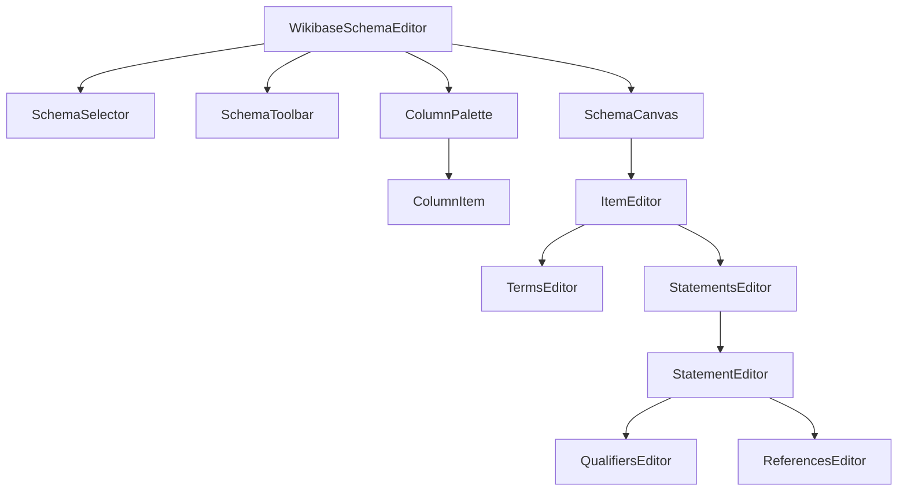

# Design Document: Wikibase Schema Editor

## Overview

The Wikibase Schema Editor is a visual interface that enables users to create mappings between tabular data columns and Wikibase item structures. The editor provides drag-and-drop functionality for mapping data columns to item Terms (Labels, Descriptions, Aliases) and Statements (property-value pairs with qualifiers and references). The design follows a component-based architecture using Vue 3 with TypeScript, integrating with the existing project structure and API endpoints.

## Architecture

### High-Level Architecture



### Component Architecture

The schema editor follows a hierarchical component structure:



## Components and Interfaces

### Core Components

#### 1. WikibaseSchemaEditor (Main Container)
- **Purpose**: Root component that orchestrates the entire schema editing experience
- **Responsibilities**:
  - Manages overall state and data flow
  - Coordinates drag-and-drop operations
  - Handles schema persistence
  - Provides validation feedback
  - Manages schema selection and creation workflow

#### 2. SchemaSelector
- **Purpose**: Manages schema selection workflow as the initial interface
- **Responsibilities**:
  - Fetches existing schemas linked to the current project using existing API
  - Displays list of available schemas with metadata (name, dates, completion status)
  - Provides "Create New Schema" button that triggers existing initialization code
  - Handles schema selection and transitions to main editor
  - Shows empty state when no schemas exist

#### 3. ColumnPalette
- **Purpose**: Displays available data columns as draggable elements with optional sample data
- **Responsibilities**:
  - Fetches column information from project data
  - Renders columns as draggable chips/badges
  - Provides visual feedback during drag operations
  - Shows column data types and conditionally shows sample values
  - Manages sample data visibility toggle state
  - Provides toggle button interface for showing/hiding sample data

#### 4. SchemaCanvas
- **Purpose**: Main editing area where schema structure is built
- **Responsibilities**:
  - Renders the item configuration interface
  - Manages drop zones for column mappings
  - Displays hierarchical schema structure
  - Handles visual feedback for valid/invalid mappings

#### 5. ItemEditor
- **Purpose**: Manages the configuration of a single Wikibase item
- **Responsibilities**:
  - Provides interface for item metadata
  - Coordinates Terms and Statements editors
  - Manages item-level validation
  - Handles item creation/deletion

#### 6. TermsEditor
- **Purpose**: Manages Labels, Descriptions, and Aliases configuration
- **Responsibilities**:
  - Provides drop zones for each term type
  - Manages multilingual configurations
  - Handles language code selection
  - Validates term mappings

#### 7. StatementsEditor
- **Purpose**: Container for managing multiple statements
- **Responsibilities**:
  - Provides interface to add/remove statements
  - Manages statement ordering
  - Coordinates individual statement editors

#### 8. StatementEditor
- **Purpose**: Configures individual property-value statements
- **Responsibilities**:
  - Property selection interface (P-ID autocomplete)
  - Value mapping configuration
  - Rank selection (preferred/normal/deprecated)
  - Data type validation

#### 9. QualifiersEditor & ReferencesEditor
- **Purpose**: Manages qualifiers and references for statements
- **Responsibilities**:
  - Provides interfaces to add/remove qualifiers/references
  - Property selection for qualifier/reference properties
  - Value mapping for qualifier/reference values

#### 10. ColumnItem
- **Purpose**: Individual draggable column element within the ColumnPalette
- **Responsibilities**:
  - Renders individual column as draggable chip
  - Shows column name and data type
  - Conditionally displays sample data based on parent toggle state
  - Handles drag start/end events for the column

### Data Models

#### Schema Data Structure
```typescript
import { 
  ItemId, 
  PropertyId, 
  Labels, 
  Descriptions, 
  Aliases, 
  Claims, 
  Item 
} from '@backend/types/wikibase-schema'

interface WikibaseSchemaMapping {
  id: string
  projectId: string
  name: string
  wikibase: string
  item: ItemSchemaMapping
  createdAt: string
  updatedAt: string
}

interface SchemaListItem {
  id: string
  name: string
  createdAt: string
  updatedAt: string
  itemCount: number
  statementCount: number
  isComplete: boolean
}

interface SchemaSelectionState {
  schemas: SchemaListItem[]
  isLoading: boolean
  selectedSchemaId: string | null
  showMainEditor: boolean
}

interface ItemSchemaMapping {
  id?: ItemId
  terms: TermsSchemaMapping
  statements: StatementSchemaMapping[]
}

interface TermsSchemaMapping {
  labels: Record<string, ColumnMapping> // language code -> column mapping
  descriptions: Record<string, ColumnMapping>
  aliases: Record<string, ColumnMapping[]>
}

interface ColumnMapping {
  columnName: string
  dataType: string
  transformation?: TransformationRule
}

interface StatementSchemaMapping {
  id: string
  property: PropertyReference
  value: ValueMapping
  rank: StatementRank
  qualifiers: QualifierSchemaMapping[]
  references: ReferenceSchemaMapping[]
}

interface PropertyReference {
  id: PropertyId // P-ID using existing PropertyId type
  label?: string
  dataType: string
}

interface ValueMapping {
  type: 'column' | 'constant' | 'expression'
  source: ColumnMapping | string
  dataType: WikibaseDataType
}

interface QualifierSchemaMapping {
  property: PropertyReference
  value: ValueMapping
}

interface ReferenceSchemaMapping {
  property: PropertyReference
  value: ValueMapping
}

type StatementRank = 'preferred' | 'normal' | 'deprecated'

// Note: This should be imported from wikibase-sdk when available
// Currently the backend TODO indicates DataType needs to be defined
type WikibaseDataType = 
  | 'string' 
  | 'wikibase-item'
  | 'wikibase-property' 
  | 'quantity' 
  | 'time' 
  | 'globe-coordinate' 
  | 'url' 
  | 'external-id'
  | 'monolingualtext'
  | 'commonsMedia'
```

#### Schema Editor Drag and Drop Integration
```typescript
// Schema editor specific drag and drop context
interface SchemaDragDropContext {
  // Global drag state (from Pinia store)
  draggedColumn: Ref<ColumnInfo | null>
  dragState: Ref<DragState>
  
  // Drop zone state from native HTML5 events
  isOverDropZone: Ref<boolean>
  hoveredTarget: Ref<string | null>
  
  // Validation and feedback
  validDropTargets: ComputedRef<DropTarget[]>
  isValidDrop: ComputedRef<boolean>
  dropFeedback: Ref<DropFeedback | null>
}

// Native HTML5 drag and drop integration for drop targets
interface DropZoneConfig {
  onDrop: (event: DragEvent) => void
  onDragEnter?: (event: DragEvent) => void
  onDragLeave?: (event: DragEvent) => void
  onDragOver?: (event: DragEvent) => void
  acceptedDataTypes: string[]
  validateDrop?: (data: string) => boolean
}

interface DropFeedback {
  type: 'success' | 'error' | 'warning'
  message: string
  suggestions?: string[]
}

interface ColumnInfo {
  name: string
  dataType: string
  sampleValues: string[]
  nullable: boolean
  uniqueCount?: number
}

interface DropTarget {
  type: 'label' | 'description' | 'alias' | 'statement' | 'qualifier' | 'reference'
  path: string // JSON path to the target location
  acceptedTypes: WikibaseDataType[]
  language?: string
  propertyId?: string
  isRequired?: boolean
}
```

## Data Models

### Extended Wikibase Schema Types

Building on the existing `wikibase-schema.ts`, we'll extend the types to support schema mapping:

```typescript
// Schema mapping specific types
export interface SchemaMapping {
  item: ItemSchemaMapping
  columnMappings: Record<string, ColumnMapping>
  validationRules: ValidationRule[]
}

export interface ItemSchemaMapping {
  terms: {
    labels: Record<string, ColumnReference>
    descriptions: Record<string, ColumnReference>
    aliases: Record<string, ColumnReference[]>
  }
  statements: StatementSchemaMapping[]
}

export interface StatementSchemaMapping {
  property: PropertyId
  value: ValueSchemaMapping
  rank: StatementRank
  qualifiers: QualifierSchemaMapping[]
  references: ReferenceSchemaMapping[]
}

export interface ValueSchemaMapping {
  columnReference: ColumnReference
  dataType: WikibaseDataType
  transformation?: TransformationFunction
}

export interface ColumnReference {
  columnName: string
  dataType: string
  required: boolean
}

export type StatementRank = 'preferred' | 'normal' | 'deprecated'
```

## Error Handling

### Validation Strategy

The editor implements multi-level validation:

1. **Real-time Validation**: Immediate feedback during drag-and-drop operations
2. **Schema Validation**: Comprehensive validation before saving
3. **Data Type Validation**: Ensures column data types are compatible with Wikibase requirements
4. **Completeness Validation**: Checks for required fields and mappings

### Error Types

```typescript
interface ValidationError {
  type: 'warning' | 'error'
  code: string
  message: string
  path: string
  suggestions?: string[]
}

// Common validation errors
const ValidationErrors = {
  MISSING_REQUIRED_MAPPING: 'Required mapping is missing',
  INCOMPATIBLE_DATA_TYPE: 'Column data type incompatible with target',
  DUPLICATE_LANGUAGE_MAPPING: 'Multiple mappings for same language',
  INVALID_PROPERTY_ID: 'Invalid or non-existent property ID',
  MISSING_STATEMENT_VALUE: 'Statement missing required value mapping'
}
```

## Testing Strategy

### Unit Testing
- Component isolation testing using Vue Test Utils
- Composable logic testing
- Data transformation function testing
- Validation rule testing

### Integration Testing
- API endpoint testing for schema CRUD operations
- Database schema persistence testing
- End-to-end drag-and-drop workflow testing

### User Experience Testing
- Drag-and-drop interaction testing
- Responsive design testing
- Accessibility compliance testing
- Performance testing with large datasets

## Implementation Approach

### Phase 1: Core Infrastructure
- Set up base component structure
- Implement data models and TypeScript interfaces
- Create basic drag-and-drop functionality
- Establish API integration patterns

### Phase 2: Schema Building
- Implement Terms editor with multilingual support
- Create Statements editor with property selection
- Add basic validation and error handling
- Implement schema persistence

### Phase 3: Advanced Features
- Add Qualifiers and References support
- Implement advanced validation rules
- Add data type transformation capabilities
- Create preview and export functionality

### Phase 4: Polish and Optimization
- Enhance user experience with animations and feedback
- Optimize performance for large schemas
- Add comprehensive error handling
- Implement accessibility features

### Phase 5: Schema Selection Enhancement
- Build SchemaSelector component for initial schema selection
- Integrate schema selection with existing WikibaseSchemaEditor
- Add schema metadata display and empty state handling
- Ensure seamless transition between selection and main editor

## Technical Decisions

### State Management
- Use Vue 3 Composition API with Pinia stores for state management
- Implement reactive schema state with automatic persistence
- Use computed properties for derived state (validation status, completion percentage)

### Schema Selection Integration
- SchemaSelector will be the initial view within WikibaseSchemaEditor
- Use existing `useSchemaApi().loadAllSchemas()` to fetch available schemas
- Transition to main editor by setting a reactive state flag
- Leverage existing schema initialization code for new schema creation

### Drag and Drop Implementation
- Use VueUse `useDraggable` for making column elements draggable with position tracking and visual feedback
- Use native HTML5 drag and drop events with `DataTransfer` API for custom data transfer between elements
- Create custom composables that combine VueUse reactivity with HTML5 drag/drop data transfer
- Implement validation logic using reactive computed properties and event handlers
- Provide visual feedback using CSS transitions and VueUse's reactive state

### API Integration
- Leverage existing Elysia backend routes for schema operations
- Use existing `loadAllSchemas`, `loadSchema`, and `createSchema` functions
- Implement optimistic updates with rollback capability
- Use Elysia Eden Treaty for type-safe API calls

### Auto-Imports Configuration
The frontend uses `unplugin-auto-import` for seamless development experience:

```typescript
// vite.config.ts - Auto-imports configuration
AutoImport({
  imports: [
    'vue',           // ref, computed, watch, etc.
    'vue-router',    // useRoute, useRouter, etc.
    'pinia',         // defineStore, storeToRefs, etc.
    '@vueuse/core',  // useDraggable, useDropZone, etc.
  ],
  dirs: ['src/**'], // Auto-import from composables and stores
  vueTemplate: true, // Enable in Vue templates
})
```

**Available Auto-Imports:**
- **Vue 3**: `ref`, `computed`, `watch`, `useTemplateRef`, `nextTick`, etc.
- **Vue Router**: `useRoute`, `useRouter`, `useRouteParams`, etc.
- **Pinia**: `defineStore`, `storeToRefs`, `useProjectStore`, etc.
- **VueUse**: `useDraggable`, `useDropZone`, `useEventListener`, etc.
- **Custom Composables**: All composables from `src/composables/`
- **Stores**: All stores from `src/stores/`
- **Types**: All types from `src/types/` are globally available

## VueUse Implementation Details

### ColumnPalette Container with Sample Data Toggle

```vue
<!-- ColumnPalette.vue - Container component with sample data toggle -->
<script setup lang="ts">
// Note: Vue, VueUse, and PrimeVue components are auto-imported
// No need to import: ref, computed, Button, etc.

const props = defineProps<{
  columns: ColumnInfo[]
}>()

// Sample data visibility state (hidden by default)
const showSampleData = ref(false)

const toggleSampleData = () => {
  showSampleData.value = !showSampleData.value
}
</script>

<template>
  <div class="column-palette">
    <!-- Toggle button at the top -->
    <div class="flex justify-between items-center mb-4">
      <h3 class="text-lg font-semibold">Columns</h3>
      <Button
        :icon="showSampleData ? 'pi pi-eye-slash' : 'pi pi-eye'"
        :label="showSampleData ? 'Hide Samples' : 'Show Samples'"
        size="small"
        severity="secondary"
        @click="toggleSampleData"
      />
    </div>
    
    <!-- Column items -->
    <div class="flex flex-wrap gap-2">
      <ColumnItem
        v-for="column in columns"
        :key="column.name"
        :column-info="column"
        :show-sample-data="showSampleData"
      />
    </div>
  </div>
</template>
```

### Column Dragging with UseDraggable Component and HTML5 DataTransfer

```vue
<!-- ColumnItem.vue - Individual draggable column component -->
<script setup lang="ts">
// Note: Vue, VueUse, and PrimeVue components are auto-imported
// No need to import: ref, computed, Chip, etc.

const props = defineProps<{
  columnInfo: ColumnInfo
  showSampleData: boolean
}>()

const dragDropStore = useDragDropStore() // Auto-imported from stores

// HTML5 drag and drop for data transfer
const handleDragStart = (event: DragEvent) => {
  // Set column data in DataTransfer for drop zones to access
  event.dataTransfer?.setData('application/x-column-data', JSON.stringify(props.columnInfo))
  event.dataTransfer?.setData('text/plain', props.columnInfo.name) // Fallback
  
  // Set drag effect
  if (event.dataTransfer) {
    event.dataTransfer.effectAllowed = 'copy'
  }
  
  // Set dragged column data in store
  dragDropStore.startDrag(props.columnInfo)
}

const handleDragEnd = (event: DragEvent) => {
  // Clean up drag state
  dragDropStore.endDrag()
}
</script>

<template>
  <UseDraggable 
    v-slot="{ isDragging }" 
    :initial-value="{ x: 0, y: 0 }"
    :prevent-default="true"
  >
    <div 
      :class="{ 
        'is-dragging': isDragging,
        'opacity-50': isDragging 
      }"
      class="column-chip cursor-grab active:cursor-grabbing"
      draggable="true"
      @dragstart="handleDragStart"
      @dragend="handleDragEnd"
    >
      <Chip 
        :label="columnInfo.name" 
        class="mb-2"
      >
        <template #default>
          <div class="flex items-center gap-2">
            <span class="font-medium">{{ columnInfo.name }}</span>
            <Chip 
              :label="columnInfo.dataType" 
              size="small"
              severity="secondary"
            />
          </div>
        </template>
      </Chip>
      
      <div 
        v-if="showSampleData && columnInfo.sampleValues?.length" 
        class="text-xs text-surface-600 mt-1"
      >
        Sample: {{ columnInfo.sampleValues.slice(0, 3).join(', ') }}
        <span v-if="columnInfo.sampleValues.length > 3">...</span>
      </div>
    </div>
  </UseDraggable>
</template>
```

### Drop Zones with Native HTML5 Events

```vue
<!-- TermsEditor.vue - Creating drop zones for labels/descriptions -->
<script setup lang="ts">
// Note: Vue, VueUse, and Pinia composables are auto-imported
// No need to import: ref, useTemplateRef, etc.

const labelDropZone = useTemplateRef<HTMLElement>('labelDropZone')
const dragDropStore = useDragDropStore() // Auto-imported from stores
const isOverLabelZone = ref(false)

// Handle drag events
const handleDragOver = (event: DragEvent) => {
  event.preventDefault() // Allow drop
  event.dataTransfer!.dropEffect = 'copy'
}

const handleDragEnter = (event: DragEvent) => {
  event.preventDefault()
  isOverLabelZone.value = true
  
  // Get column data from drag operation
  const columnData = event.dataTransfer?.getData('application/x-column-data')
  if (columnData) {
    const column = JSON.parse(columnData)
    // Visual feedback based on validation
    if (isValidDropForLabels(column)) {
      event.currentTarget?.classList.add('drop-zone-valid')
    } else {
      event.currentTarget?.classList.add('drop-zone-invalid')
    }
  }
}

const handleDragLeave = (event: DragEvent) => {
  isOverLabelZone.value = false
  // Remove visual feedback
  event.currentTarget?.classList.remove('drop-zone-valid', 'drop-zone-invalid')
}

const handleDrop = (event: DragEvent) => {
  event.preventDefault()
  isOverLabelZone.value = false
  
  // Get the column data from the drag operation
  const columnData = event.dataTransfer?.getData('application/x-column-data')
  if (columnData) {
    const column = JSON.parse(columnData)
    if (isValidDropForLabels(column)) {
      handleColumnDrop('label', column, 'en')
    }
  }
  
  // Clean up visual feedback
  event.currentTarget?.classList.remove('drop-zone-valid', 'drop-zone-invalid')
}
</script>

<template>
  <div 
    ref="labelDropZone"
    :class="{ 
      'drop-zone-active': isOverLabelZone,
      'drop-zone-valid': isValidDropForLabels(dragDropStore.draggedColumn),
      'drop-zone-invalid': dragDropStore.draggedColumn && !isValidDropForLabels(dragDropStore.draggedColumn)
    }"
    class="label-drop-zone"
    @dragover="handleDragOver"
    @dragenter="handleDragEnter"
    @dragleave="handleDragLeave"
    @drop="handleDrop"
  >
    <span v-if="!labelMapping">Drop column for labels</span>
    <ColumnMapping v-else :mapping="labelMapping" />
  </div>
</template>
```

### Validation and Feedback System

```typescript
// useSchemaValidation.ts - Composable for drag validation
// Note: Vue composables are auto-imported (ref, computed, etc.)
export function useSchemaValidation() {
  const draggedColumn = ref<ColumnInfo | null>(null)
  
  const isValidDropForLabels = (column: ColumnInfo | null): boolean => {
    if (!column) return false
    // Labels accept string-like data types
    return ['VARCHAR', 'TEXT', 'STRING'].includes(column.dataType.toUpperCase())
  }
  
  const isValidDropForStatements = (column: ColumnInfo | null, propertyDataType: WikibaseDataType): boolean => {
    if (!column) return false
    
    const compatibilityMap: Record<WikibaseDataType, string[]> = {
      'string': ['VARCHAR', 'TEXT', 'STRING'],
      'quantity': ['INTEGER', 'DECIMAL', 'NUMERIC', 'FLOAT'],
      'time': ['DATE', 'DATETIME', 'TIMESTAMP'],
      'wikibase-item': ['VARCHAR', 'TEXT'], // Assuming item IDs as strings
      'url': ['VARCHAR', 'TEXT'],
      // ... more mappings
    }
    
    return compatibilityMap[propertyDataType]?.includes(column.dataType.toUpperCase()) ?? false
  }
  
  const getDropFeedback = (column: ColumnInfo | null, targetType: DropTargetType): DropFeedback | null => {
    if (!column) return null
    
    switch (targetType) {
      case 'label':
        return isValidDropForLabels(column) 
          ? { type: 'success', message: 'Valid mapping for labels' }
          : { 
              type: 'error', 
              message: 'Invalid data type for labels',
              suggestions: ['Use text-based columns for labels']
            }
      // ... more cases
    }
  }
  
  return {
    draggedColumn,
    isValidDropForLabels,
    isValidDropForStatements,
    getDropFeedback
  }
}
```

### Global Drag State Management

```typescript
// stores/dragDrop.ts - Pinia store for drag state
export const useDragDropStore = defineStore('dragDrop', () => {
  const draggedColumn = ref<ColumnInfo | null>(null)
  const dragState = ref<DragState>('idle')
  const validDropTargets = ref<string[]>([])
  const hoveredTarget = ref<string | null>(null)
  
  const startDrag = (column: ColumnInfo) => {
    draggedColumn.value = column
    dragState.value = 'dragging'
    // Calculate valid drop targets based on column data type
    validDropTargets.value = calculateValidTargets(column)
  }
  
  const endDrag = () => {
    draggedColumn.value = null
    dragState.value = 'idle'
    validDropTargets.value = []
    hoveredTarget.value = null
  }
  
  const setHoveredTarget = (targetPath: string | null) => {
    hoveredTarget.value = targetPath
  }
  
  return {
    draggedColumn: readonly(draggedColumn),
    dragState: readonly(dragState),
    validDropTargets: readonly(validDropTargets),
    hoveredTarget: readonly(hoveredTarget),
    startDrag,
    endDrag,
    setHoveredTarget
  }
})
```

This design provides a comprehensive foundation for implementing the Wikibase Schema Editor using VueUse's drag and drop composables, maintaining consistency with the existing codebase architecture and ensuring scalability for future enhancements.
